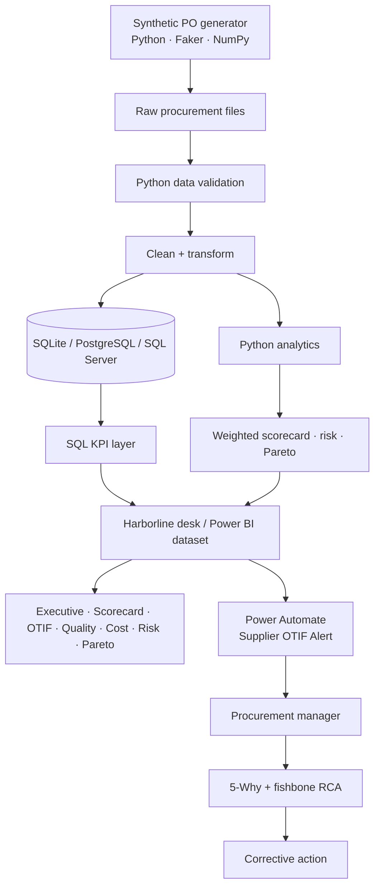

# Architecture

Independent Procurement Analytics Project using a synthetic procurement dataset.

Complementary to a Demand Forecasting & Inventory Optimization project:

- Project 1 answers *what to buy and when*.
- Harborline answers *who delivered, at what quality and cost, and what to do next*.

Local runtime uses SQLite so the repo stays credential-free. `sql/` objects are written as views; swap the loader DSN for PostgreSQL or SQL Server without changing the grain of `fact_purchase_orders`.
